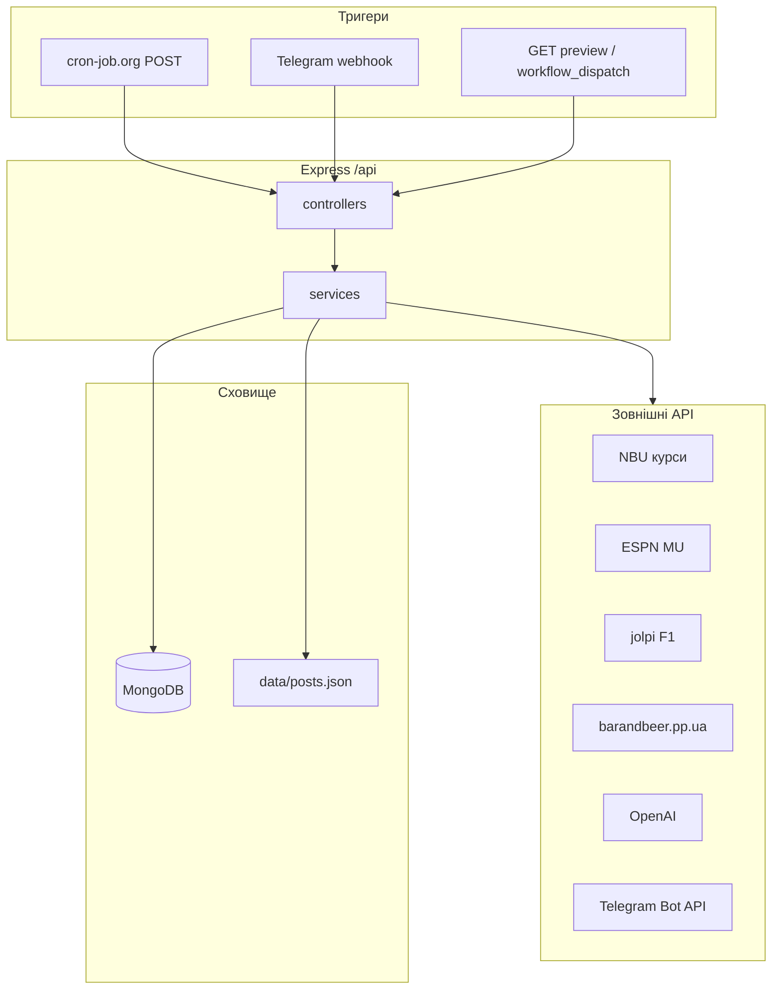

# Гайд по проєкту tg-daily-reporter (для AI та розробників)

Цей документ — **вхідна інструкція** для моделей та людей: призначення репозиторію, структура папок і файлів, API, потоки даних, змінні середовища та деплой. Деталі розкладу на проді: [external-cron.md](./external-cron.md). Таблиця HTTP API для людей: [README.md](../README.md).

---

## 1. Огляд проєкту

**tg-daily-reporter** — сервер на **Node.js + Express 5 + TypeScript** для Telegram-чату. Основні функції:

- **Ранковий звіт** — курси USD/EUR (НБУ), матчі Manchester United та Оболонь, наступна гонка F1, меню розливного пива, генерація тексту через **OpenAI**, відправка в Telegram.
- **Пости про розливне** — за розкладом (ср / пт / сб за документацією cron).
- **Тижневий розіграш** — активність у чаті за період «субота–субота», вибір переможця, пост у Telegram.
- **Webhook Telegram** — збереження повідомлень користувачів у **MongoDB** для обліку активності.

Типовий деплой: **Render Free** (процес засинає без трафіку). Розклад викликів: **cron-job.org** (POST на HTTPS). GitHub Actions `schedule` у цьому репозиторії **не використовується** для щоденного запуску (лише ручний `workflow_dispatch`); див. [.github/workflows/](../.github/workflows/).

---

## 2. Технології та npm-скрипти

| Скрипт | Призначення |
|--------|-------------|
| `npm run dev` | Розробка: `ts-node-dev` з перезапуском, точка входу `src/server.ts` |
| `npm run build` | Компіляція TypeScript → каталог `dist/` |
| `npm start` | Прод: `node dist/server.js` |
| `npm run typecheck` | `tsc --noEmit` без збірки |

**Залежності (основні):** `express`, `mongoose`, `openai`, `axios`, `cheerio`, `dotenv`, `zod`, `node-cron`.

---

## 3. Структура кореня репозиторію

| Шлях | Опис |
|------|------|
| `src/` | Увесь код застосунку |
| `frontApp/` | Фронтенд **Vue 3 + Vite + TypeScript**; аліаси `@/`, `@pages/`, `@router/`, `@components/`, `@styles/`; ESLint + Prettier; окремий `package.json`, проксі `/api` → `localhost:3000` у dev. Деталі — [frontApp/README.md](../frontApp/README.md) |
| `docs/` | Документація: `external-cron.md`, `project-guide.md` |
| `.github/workflows/` | GitHub Actions: ручний виклик prod URL через `curl` |
| `README.md` | Перелік маршрутів API (українською) |
| `AGENTS.md` | Коротка інструкція для AI-агента Cursor |
| `package.json` / `package-lock.json` | Залежності та скрипти |
| `tsconfig.json` | Налаштування TS (наприклад, `outDir: dist`) |
| `.gitignore` | Ігнор: `node_modules`, `dist`, `.env`, `data` |

**Не комітяться (або генеруються):** `node_modules/`, `dist/`, `.env`, каталог `data/` з `posts.json` (файл створюється під час роботи, див. `postStorage.ts`).

---

## 4. Дерево `src/` і призначення файлів

### 4.1. Точка входу та застосунок

| Файл | Призначення |
|------|-------------|
| [src/server.ts](../src/server.ts) | `listen`, підключення MongoDB (`connectToMongo`), опційний запуск `startMorningReportJob()` якщо `ENABLE_CRON === true`. Для Render Free cron усередині процесу зазвичай непридатний через sleep. |
| [src/app.ts](../src/app.ts) | Створення Express: `express.json()`, монтування `routes` під префіксом `/api`, 404 JSON, глобальний `errorHandler`. |

### 4.2. `src/config/`

| Файл | Призначення |
|------|-------------|
| [env.ts](../src/config/env.ts) | Завантаження `.env`, валідація через **zod**, експорт об’єкта `env` (trim для чутливих рядків). |

### 4.3. `src/routes/`

Усі маршрути підключаються в [index.ts](../src/routes/index.ts) під `/api` (див. таблицю нижче).

| Файл | Призначення |
|------|-------------|
| [index.ts](../src/routes/index.ts) | Збірка роутера: `GET /health`, підключення підшляхів `/telegram`, `/reports`, `/activity`, `/raffle`, `/draw-beer`. |
| [reports.ts](../src/routes/reports.ts) | `GET /morning-preview` → прев’ю даних ранкового звіту без OpenAI. |
| [morningText.ts](../src/routes/morningText.ts) | `GET /morning-text-preview` → дані + генерація тексту OpenAI, без відправки в Telegram. |
| [sendMorning.ts](../src/routes/sendMorning.ts) | `POST /send-morning-test` → повна відправка ранкового звіту (cron / тест). |
| [telegram.ts](../src/routes/telegram.ts) | `GET /test` → тестове повідомлення в Telegram; `POST /admin/send-message` → адмінська відправка довільного повідомлення ботом у `TELEGRAM_CHAT_ID`; `POST /admin/edit-message` → AI-редагування адмінського тексту без відправки в Telegram. |
| [telegramWebhook.ts](../src/routes/telegramWebhook.ts) | `POST /webhook` → прийом оновлень від Bot API. |
| [activity.ts](../src/routes/activity.ts) | `GET /active-users` → список активних користувачів за період; `GET /users` → усі збережені користувачі чату. |
| [raffle.ts](../src/routes/raffle.ts) | `GET /pick-weekly-winner` → вибір переможця (без поста розіграшу в чат). |
| [sendRaffleResult.ts](../src/routes/sendRaffleResult.ts) | `POST /send-raffle-result` → повний сценарій поста з результатом розіграшу. |
| [sentDrawBeerPost.ts](../src/routes/sentDrawBeerPost.ts) | `POST /send-post` під префіксом `draw-beer` → пост про розливне. |

### 4.4. `src/controllers/`

| Файл | Призначення |
|------|-------------|
| [reportController.ts](../src/controllers/reportController.ts) | `getMorningReportPreview` — JSON з `buildMorningReport`. |
| [morningTextController.ts](../src/controllers/morningTextController.ts) | `getMorningTextPreview` — дані + `generateMorningPost`, відповідь JSON. |
| [sendMorningController.ts](../src/controllers/sendMorningController.ts) | `sendMorningTest` — перевірка `x-cron-secret` vs `SEND_REPORT_SECRET`, `sendMorningReport`, `trackBotMessage`. |
| [sendDrawBeerPostController.ts](../src/controllers/sendDrawBeerPostController.ts) | Розливне: секрет, активні користувачі за період, генерація, Telegram. |
| [sendRaffleResultController.ts](../src/controllers/sendRaffleResultController.ts) | Результат розіграшу: секрет, період, переможець, leaderboard, OpenAI, Telegram. |
| [telegramController.ts](../src/controllers/telegramController.ts) | Тест відправки в Telegram; адмінська відправка повідомлення через `sendMessageByAdmin`; AI-редагування адмінського тексту через `editAdminTelegramMessage`. |
| [telegramWebhookController.ts](../src/controllers/telegramWebhookController.ts) | Розбір `update`, збереження повідомлень / активності. |
| [activityController.ts](../src/controllers/activityController.ts) | HTTP для активних користувачів. |
| [raffleController.ts](../src/controllers/raffleController.ts) | HTTP для `pick-weekly-winner`. |
| [getObolonData.ts](../src/controllers/getObolonData.ts) | Допоміжний контролер: JSON наступного матчу Оболонь. **На момент написання гайду не підключений до роутера** — можливий кандидат для дебаг-ендпоінту. |

### 4.5. `src/services/`

#### `services/reports/`

| Файл | Призначення |
|------|-------------|
| [buildMorningReport.ts](../src/services/reports/buildMorningReport.ts) | Паралельний збір: NBU USD/EUR, MU, F1, пиво, Оболонь; форматування дат/дня тижня українською. |
| [sendMorningReport.ts](../src/services/reports/sendMorningReport.ts) | Збір даних, `generateMorningPost`, `sendTelegramMessage`, `savePost`. |

#### `services/openai/`

| Файл | Призначення |
|------|-------------|
| [generateMorningPost.ts](../src/services/openai/generateMorningPost.ts) | Промпт і виклик OpenAI для ранкового поста. |
| [generateDrawBeerPost.ts](../src/services/openai/generateDrawBeerPost.ts) | Текст поста про розливне. |
| [generateRaffleWinnerPost.ts](../src/services/openai/generateRaffleWinnerPost.ts) | Текст поста з результатом розіграшу. |
| [editAdminTelegramMessage.ts](../src/services/openai/editAdminTelegramMessage.ts) | Легке AI-редагування вже написаного адміном Telegram-тексту без генерації нового поста з нуля. |

#### `services/currency/`

| Файл | Призначення |
|------|-------------|
| [getUsdToUahRate.ts](../src/services/currency/getUsdToUahRate.ts) | API НБУ, курс USD/UAH. |
| [getEurToUahRate.ts](../src/services/currency/getEurToUahRate.ts) | API НБУ, курс EUR/UAH. |

#### `services/sports/`

| Файл | Призначення |
|------|-------------|
| [getNextManchesterUnitedMatch.ts](../src/services/sports/getNextManchesterUnitedMatch.ts) | Наступний матч MU (ESPN). |
| [getObolonNextMatch.ts](../src/services/sports/getObolonNextMatch.ts) | Наступний матч Оболонь (сайт клубу, axios + парсинг). |

#### `services/f1/`

| Файл | Призначення |
|------|-------------|
| [getNextRace.ts](../src/services/f1/getNextRace.ts) | Наступна гонка F1 (jolpi / Ergast-стиль API). |

#### `services/beer/`

| Файл | Призначення |
|------|-------------|
| [getTapBeerList.ts](../src/services/beer/getTapBeerList.ts) | Меню розливного пива (HTTP + cheerio). |

#### `services/telegram/`

| Файл | Призначення |
|------|-------------|
| [sendMessage.ts](../src/services/telegram/sendMessage.ts) | Відправка повідомлення через Bot API. |
| [sendMessageByAdmin.ts](../src/services/telegram/sendMessageByAdmin.ts) | Відправка довільного адмінського повідомлення через Bot API без запису в `BotMessage`. |

#### `services/activity/`

| Файл | Призначення |
|------|-------------|
| [getActiveUsersForPeriod.ts](../src/services/activity/getActiveUsersForPeriod.ts) | Агрегація активних за діапазоном дат. |
| [getChatUsers.ts](../src/services/activity/getChatUsers.ts) | Список усіх збережених користувачів чату, відсортований за останньою активністю. |
| [trackChatMessage.ts](../src/services/activity/trackChatMessage.ts) | Запис активності з webhook. |

#### `services/raffle/`

| Файл | Призначення |
|------|-------------|
| [pickWeeklyWinner.ts](../src/services/raffle/pickWeeklyWinner.ts) | Логіка вибору переможця. |
| [getWeeklyWinnerLeaderboard.ts](../src/services/raffle/getWeeklyWinnerLeaderboard.ts) | Таблиця лідерів для тексту поста. |

#### `services/bot/`

| Файл | Призначення |
|------|-------------|
| [getBotMessages.ts](../src/services/bot/getBotMessages.ts) | Останні повідомлення бота з Mongo для контексту OpenAI. |
| [trackBotMessage.ts](../src/services/bot/trackBotMessage.ts) | Збереження відправленого поста бота. |

### 4.6. `src/models/` (Mongoose)

| Файл | Призначення |
|------|-------------|
| [ChatMessage.ts](../src/models/ChatMessage.ts) | Повідомлення користувачів у чаті (для активності). |
| [ChatUser.ts](../src/models/ChatUser.ts) | Облік користувачів чату. |
| [BotMessage.ts](../src/models/BotMessage.ts) | Пости бота для історії. |
| [WeeklyWinner.ts](../src/models/WeeklyWinner.ts) | Збережені переможці розіграшів. |

### 4.7. `src/db/`

| Файл | Призначення |
|------|-------------|
| [mongo.ts](../src/db/mongo.ts) | `mongoose.connect`, перевірка `MONGODB_URI`, опційно `dbName`. |

### 4.8. `src/jobs/`

| Файл | Призначення |
|------|-------------|
| [morningReportJob.ts](../src/jobs/morningReportJob.ts) | `node-cron` з timezone `Europe/Kyiv`; викликає `sendMorningReport`. Активний лише якщо `ENABLE_CRON=true`. |

### 4.9. `src/middlewares/`

| Файл | Призначення |
|------|-------------|
| [errorHandler.ts](../src/middlewares/errorHandler.ts) | Централізована обробка помилок Express. |

### 4.10. `src/storage/`

| Файл | Призначення |
|------|-------------|
| [postStorage.ts](../src/storage/postStorage.ts) | Локальний JSON `data/posts.json` — останні тексти постів (обмеження кількості в коді). |

### 4.11. `src/utils/`

| Файл | Призначення |
|------|-------------|
| [asyncHandler.ts](../src/utils/asyncHandler.ts) | Обгортка для async route handlers (передача помилок у `next`). |
| [date.ts](../src/utils/date.ts) | `getWeekdayNameUk`, `getReportingPeriodPreviousSaturdayThroughNextSaturday` (період для розіграшу / розливного). |
| [formatKyivDateTime.ts](../src/utils/formatKyivDateTime.ts) | Форматування дати/часу в часовому поясі Києва. |
| [formatDateUk.ts](../src/utils/formatDateUk.ts) | Форматування дати українською для UI/постів. |
| [formatErrorForLog.ts](../src/utils/formatErrorForLog.ts) | Безпечне логування помилок. |

---

## 5. Повна таблиця HTTP API (префікс `/api`)

| Метод | Шлях | Авторизація | Опис |
|-------|------|-------------|------|
| GET | `/api/health` | — | Статус сервера. |
| GET | `/api/reports/morning-preview` | — | JSON даних ранкового звіту без OpenAI. |
| GET | `/api/reports/morning-text-preview` | — | Дані + текст OpenAI, без Telegram. |
| POST | `/api/reports/send-morning-test` | Заголовок `x-cron-secret` = `SEND_REPORT_SECRET` | Відправка ранкового звіту в Telegram. |
| GET | `/api/telegram/test` | — | Тест Telegram (потрібні токени в env). |
| POST | `/api/telegram/admin/send-message` | Google session + email у `ADMIN_EMAILS` | Відправка довільного повідомлення від імені бота у `TELEGRAM_CHAT_ID`. |
| POST | `/api/telegram/admin/edit-message` | Google session + email у `ADMIN_EMAILS` | AI-редагування адмінського тексту; повертає `editedText` і нічого не відправляє в Telegram. |
| POST | `/api/telegram/webhook` | — | Webhook Bot API (`Content-Type: application/json`). |
| GET | `/api/activity/active-users` | — | Активні користувачі (query `chatId` опційно). |
| GET | `/api/activity/users` | — | Усі збережені користувачі чату (query `chatId` опційно). |
| GET | `/api/raffle/pick-weekly-winner` | — | Вибір переможця без поста в чат. |
| POST | `/api/raffle/send-raffle-result` | `x-cron-secret` | Пост з результатом розіграшу. |
| POST | `/api/draw-beer/send-post` | `x-cron-secret` | Пост про розливне. |

---

## 6. Ключові потоки

1. **Ранковий пост (production):** зовнішній cron → `POST /api/reports/send-morning-test` → `sendMorningReport` → `buildMorningReport` → `generateMorningPost` → `sendTelegramMessage` → `savePost` + `trackBotMessage`.
2. **Прев’ю:** `GET /api/reports/morning-preview` або `GET /api/reports/morning-text-preview` (довго через OpenAI і cold start на Render).
3. **Розіграш у чат:** `POST /api/raffle/send-raffle-result` → період субота–субота → `pickWeeklyWinner`, leaderboard, OpenAI, Telegram.
4. **Webhook:** `POST /api/telegram/webhook` → збереження повідомлень у Mongo для подальшої активності та розіграшів.

---

## 7. Змінні середовища

| Змінна | Опис |
|--------|------|
| `PORT` | Порт HTTP (за замовчуванням 3000). |
| `NODE_ENV` | `development` \| `production` \| `test`. |
| `TELEGRAM_BOT_TOKEN` | Токен бота. |
| `TELEGRAM_CHAT_ID` | ID чату для постів і обліку. |
| `ADMIN_EMAILS` | Кома-розділений allowlist email-ів, яким backend дозволяє адмінські дії, наприклад відправку повідомлення ботом. |
| `OPENAI_API_KEY` | Ключ OpenAI. |
| `ENABLE_CRON` | Рядок `"true"` / інше — увімкнути `node-cron` на сервері (на Render Free зазвичай `false`). |
| `CRON_TIME` | Вираз cron для ранкового job (за замовчуванням `0 8 * * *`), timezone у коді — `Europe/Kyiv`. |
| `SEND_REPORT_SECRET` | Секрет для заголовка `x-cron-secret` на POST-ендпоінтах відправки. |
| `MONGODB_URI` | URI MongoDB (обов’язково для роботи з БД). |
| `MONGODB_DB_NAME` | Ім’я БД (опційно, передається в `mongoose.connect`). |

Секрети не комітити; використовувати змінні середовища хостингу.

---

## 8. GitHub Actions

Файли в `.github/workflows/`:

- `send-morning-report.yml` — `workflow_dispatch`, `curl POST` на `secrets.REPORT_URL` з заголовком `secrets.CRON_SECRET`.
- `send-draw-beer-post.yml` — аналогічно для `DRAW_BEER_POST_URL`.
- `send-raffle-result.yml` — для `RAFFLE_RESULT_URL`.

Усі три призначені для **ручного** резервного запуску; щоденний розклад описаний у [external-cron.md](./external-cron.md).

---

## 9. Конвенції для змін у коді (AI / люди)

- Дотримуватися шару **routes → controllers → services**; бізнес-логіку не переносити в роути.
- Не хардкодити ключі та токени; усі секрети — через `env`.
- Час і дні тижня для користувачів чату — орієнтир **Europe/Kyiv** (див. `morningReportJob`, `date.ts`, форматтери).
- Нові захищені cron-ендпоінти: той самий патерн, що в `sendMorningController` / `sendDrawBeerPostController` / `sendRaffleResultController` (`x-cron-secret` vs `env.sendReportSecret`).
- Мінімальний diff: не рефакторити непов’язаний код без запиту.
- Окремої папки `tests/` у проєкті немає; нові тести — за домовленістю з командою.

---

## 10. Додатково: `src/server.ts` і DNS

У `server.ts` викликається `dns.setDefaultResultOrder("ipv4first")` — обхід проблем з IPv6 на деяких VPS/контейнерах.

---

*Останнє оновлення гайду узгоджене зі структурою репозиторію на момент створення файлу. При додаванні нових роутів або сервісів варто оновити цей документ.*
